# NASA Images
### [Android APK](https://raw.githubusercontent.com/shamilkeheliya/NASA-MobileApp/main/NASA-Images.apk)

This mobile application was created for the NASA image library using Flutter.

# Features
 - Working on both Android and iOS devices
 - Download Images
 - [Light Theme](https://github.com/shamilkeheliya/NASA-MobileApp#light-theme) & [Dark Theme](https://github.com/shamilkeheliya/NASA-MobileApp#dark-theme)
 - Search with Staring Year & Ending Year
 - Go through the pages

# ScreenShots
### Light Theme
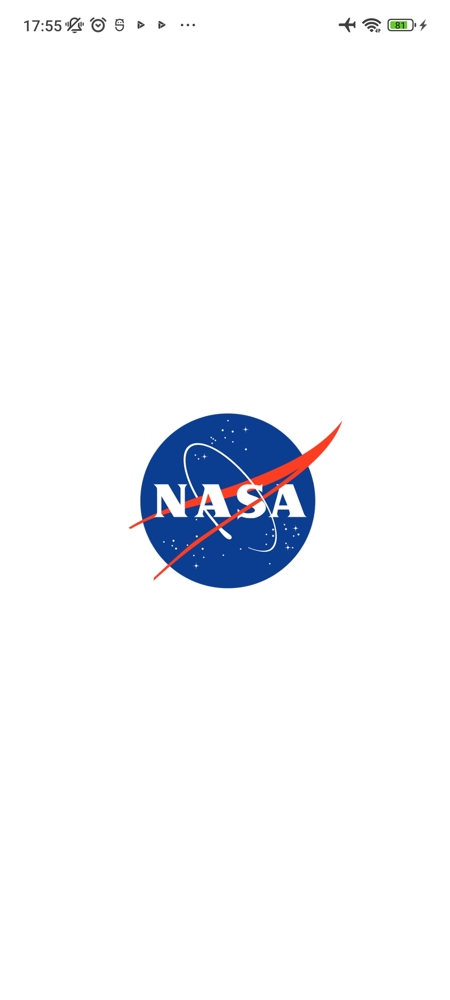 Splash Screen | 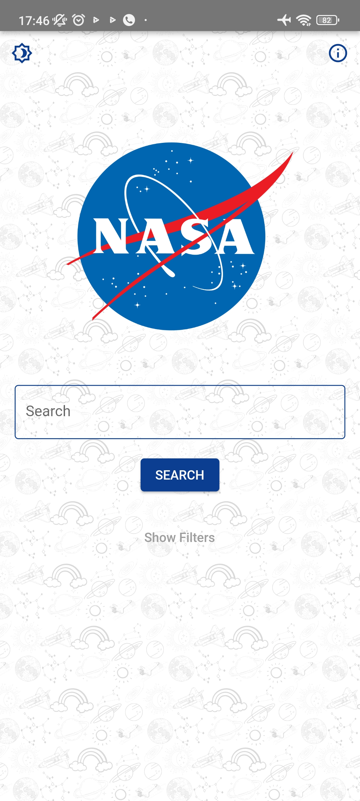 Home | 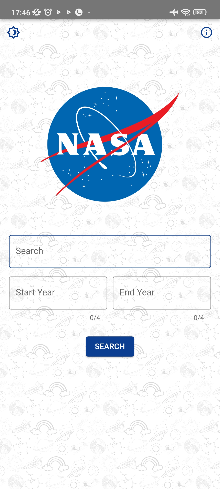 Home with Filters
:-------------------------:|:-------------------------:|:-------------------------:
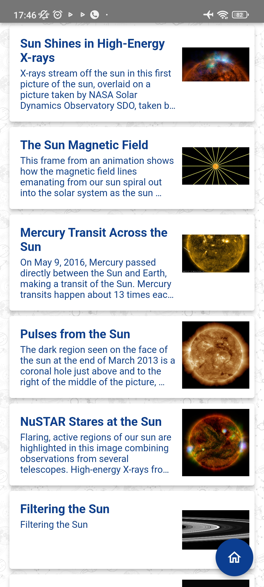 Content List View | 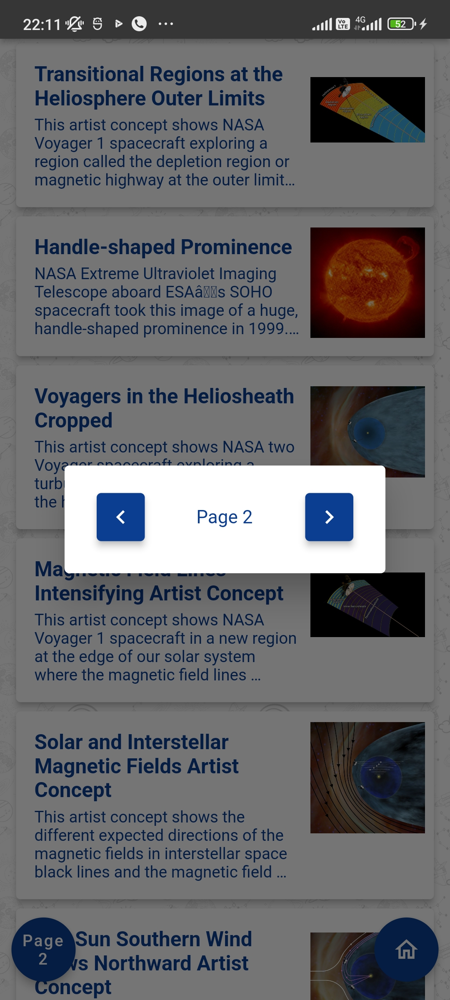 Page Navigation | 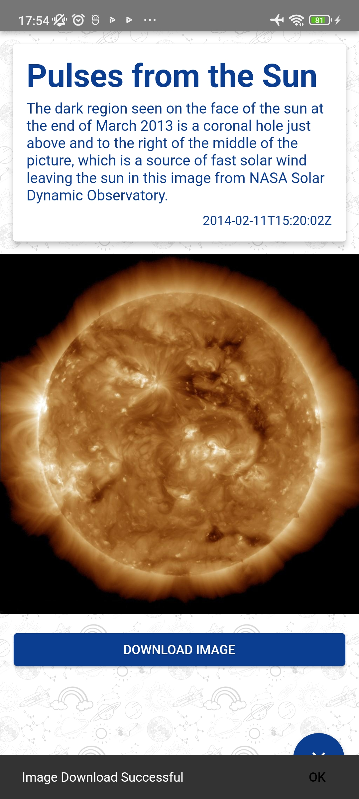 Single Content View

### Dark Theme
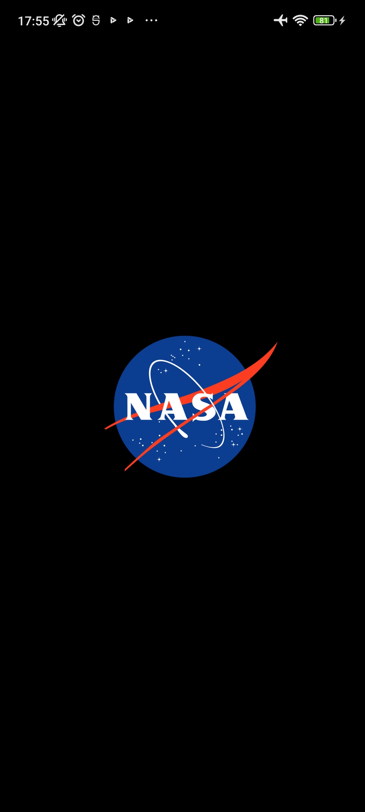 Splash Screen | 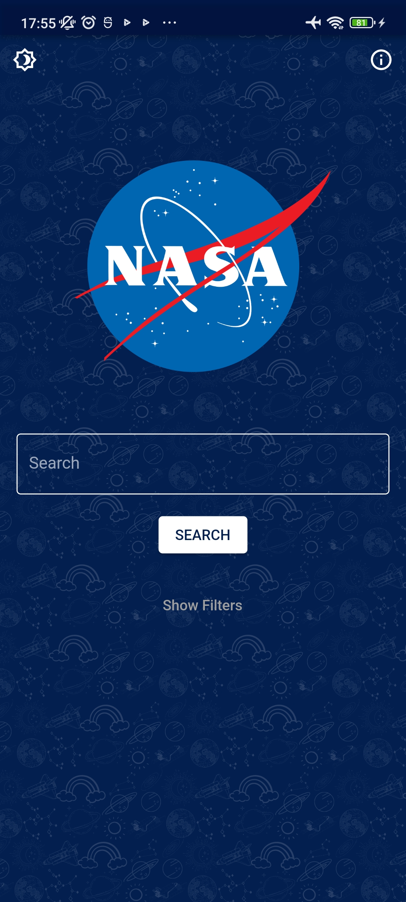 Home | 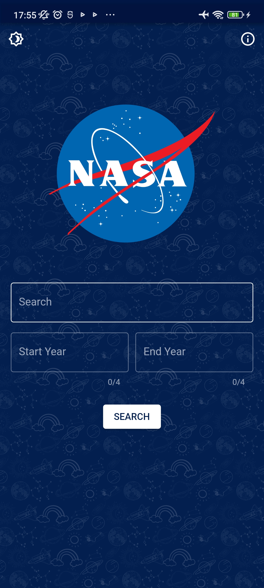 Home with Filters
:-------------------------:|:-------------------------:|:-------------------------:
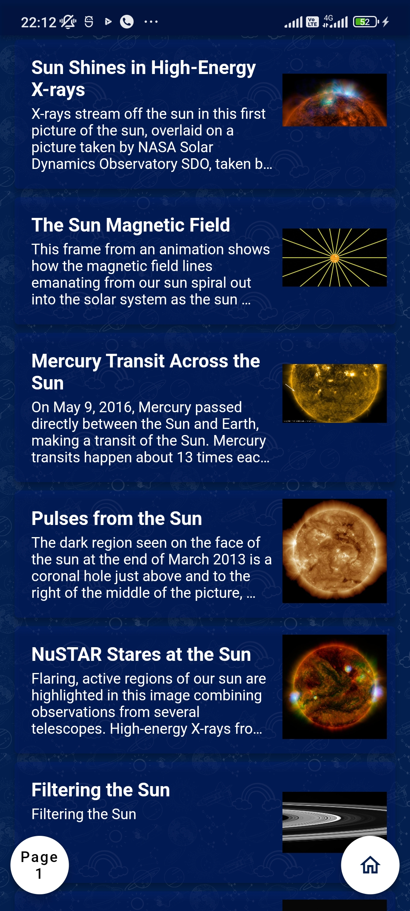 Content List View | 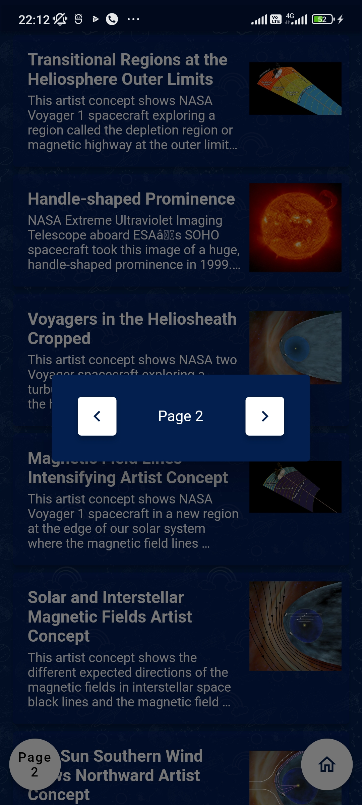 Page Navigation | 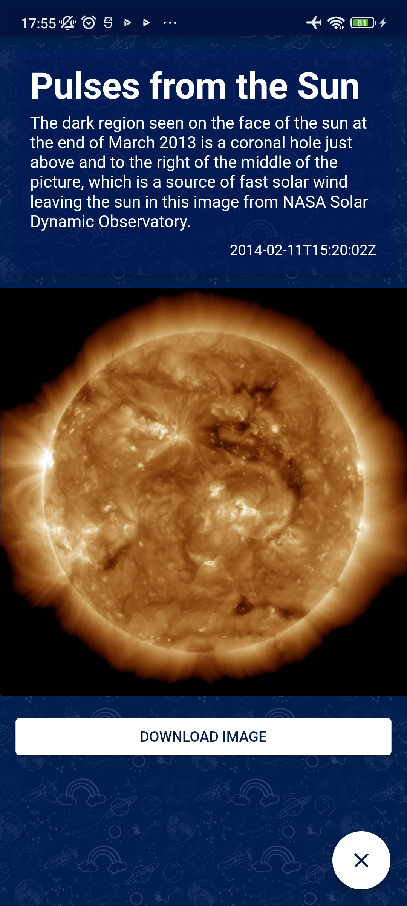 Single Content View

# Libraries
- [http](https://pub.dev/packages/http)
- [shared_preferences](https://pub.dev/packages/shared_preferences)
- [provider](https://pub.dev/packages/provider)
- [modal_progress_hud_nsn](https://pub.dev/packages/modal_progress_hud_nsn)
- [url_launcher](https://pub.dev/packages/url_launcher)
- [cached_network_image](https://pub.dev/packages/cached_network_image)
- [flutter_spinkit](https://pub.dev/packages/flutter_spinkit)
- [image_downloader](https://pub.dev/packages/image_downloader)
