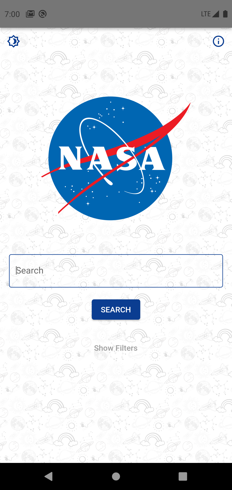
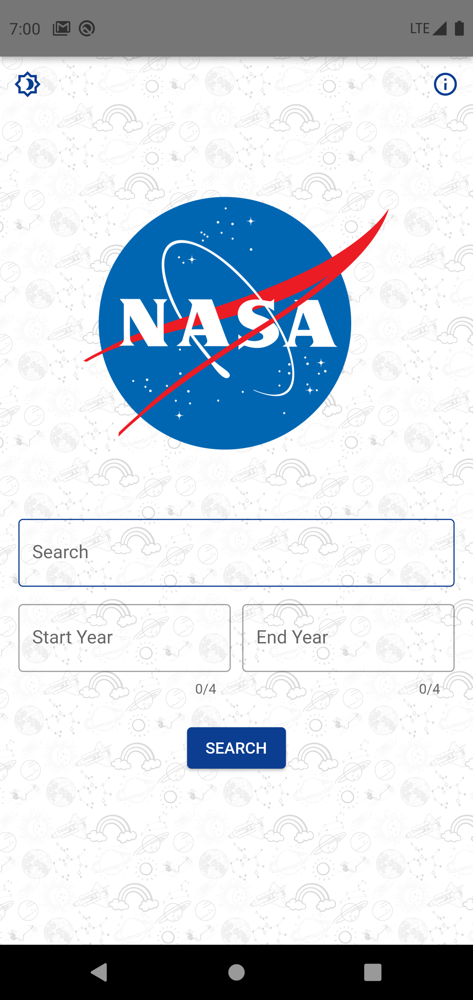
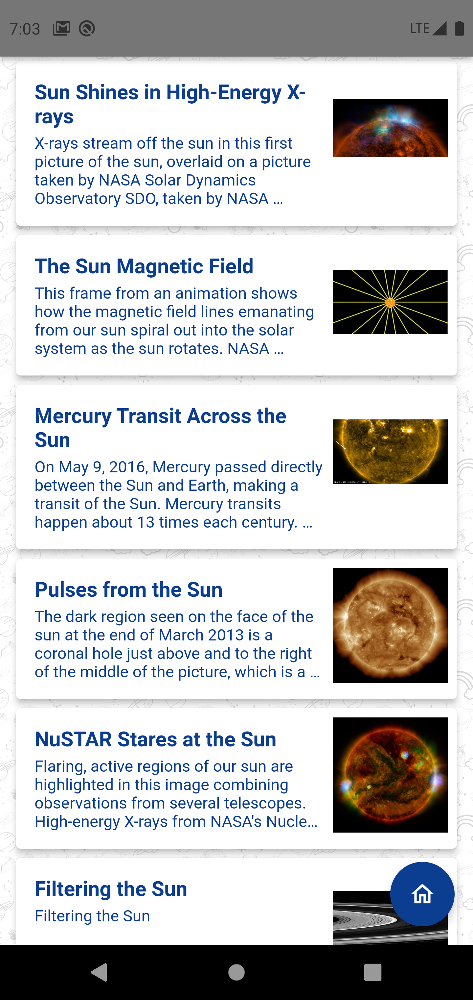
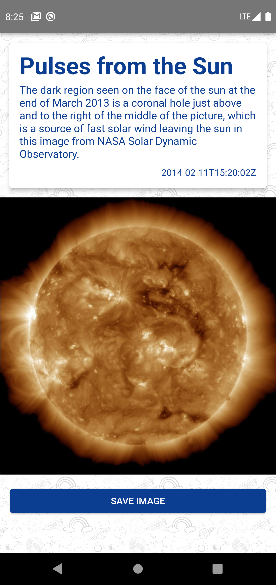
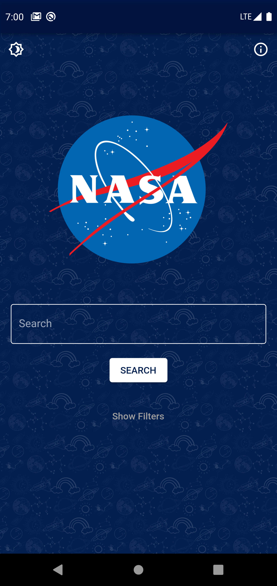
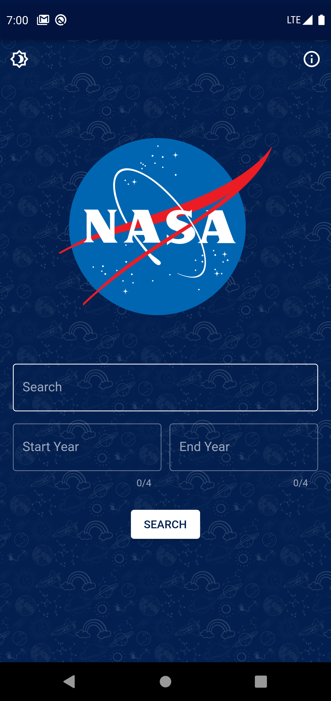
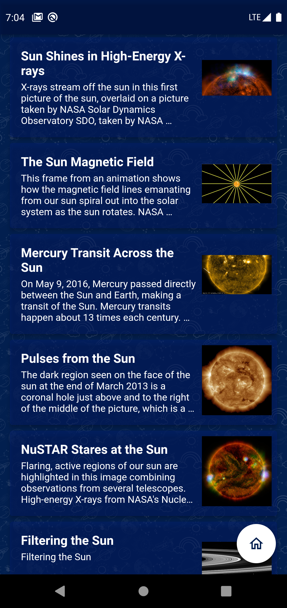
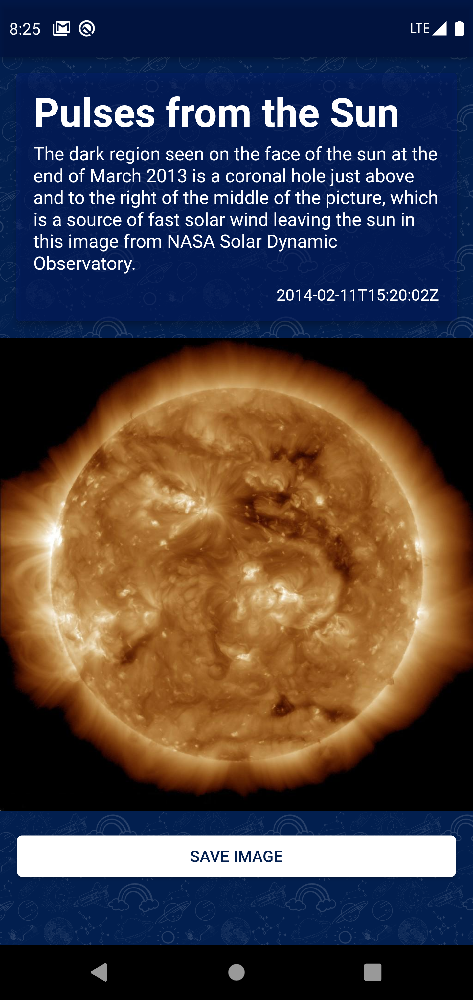

# NASA Images (Under Development)
### Mobile Application - Flutter

This mobile application was created for the NASA image library using Flutter.

# Features
 - Working on both Android and iOS devices
 - Light & Dark themes

# To Do
 - Function to save images to device
 - Add Lazy Loader to the ListView
 - Add Button to go to the Next Page

# ScreenShots
### Light Theme
 Home |  Home with Filters
:-------------------------:|:-------------------------:
 ListView |  Single Content View

### Dark Theme
 Home |  Home with Filters
:-------------------------:|:-------------------------:
 ListView |  Single Content View

# Libraries
- [http](https://pub.dev/packages/http)
- [shared_preferences](https://pub.dev/packages/shared_preferences)
- [provider](https://pub.dev/packages/provider)
- [modal_progress_hud_nsn](https://pub.dev/packages/modal_progress_hud_nsn)
- [url_launcher](https://pub.dev/packages/url_launcher)
- [cached_network_image](https://pub.dev/packages/cached_network_image)
- [flutter_spinkit](https://pub.dev/packages/flutter_spinkit)
- [image_downloader](https://pub.dev/packages/image_downloader)