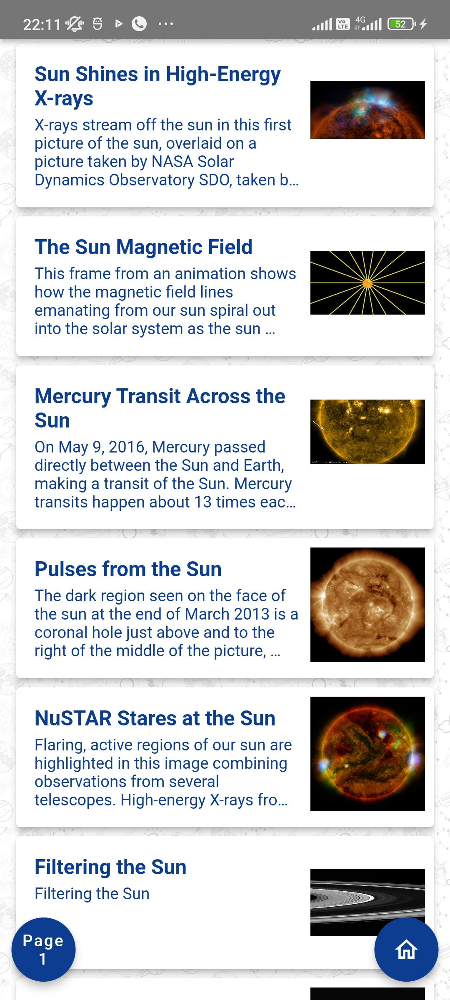
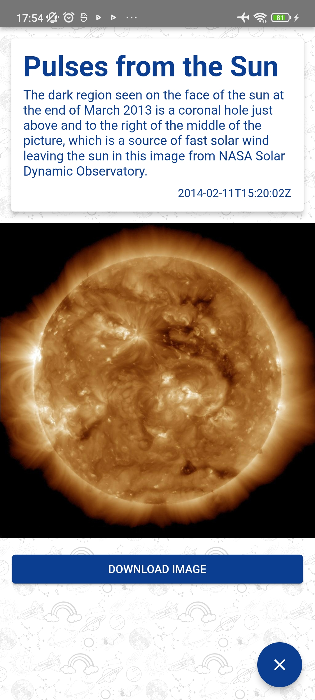

# NASA Images (Under Development)
### Mobile Application - Flutter

This mobile application was created for the NASA image library using Flutter.

# Features
 - Working on both Android and iOS devices
 - Download Images
 - Light & Dark themes

# To Do
 - Add Lazy Loader to the ListView
 - Add Button to go to the Next Page

# ScreenShots

### Light Theme
 Splash Screen (Light Theme) |  Home (Light Theme) |  Home with Filters (Light Theme)
:-------------------------:|:-------------------------:|:-------------------------:
 Content List View (Light Theme) |  Single Content View (Light Theme) |  While Image Downloading (Light Theme)

### Dark Theme
 Splash Screen (Dark Theme) |  Home (Light Theme) |  Home with Filters (Dark Theme)
:-------------------------:|:-------------------------:|:-------------------------:
 Content List View (Dark Theme) |  Single Content View (Dark Theme) |  While Image Downloading (Dark Theme)

# Libraries
- [http](https://pub.dev/packages/http)
- [shared_preferences](https://pub.dev/packages/shared_preferences)
- [provider](https://pub.dev/packages/provider)
- [modal_progress_hud_nsn](https://pub.dev/packages/modal_progress_hud_nsn)
- [url_launcher](https://pub.dev/packages/url_launcher)
- [cached_network_image](https://pub.dev/packages/cached_network_image)
- [flutter_spinkit](https://pub.dev/packages/flutter_spinkit)
- [image_downloader](https://pub.dev/packages/image_downloader)